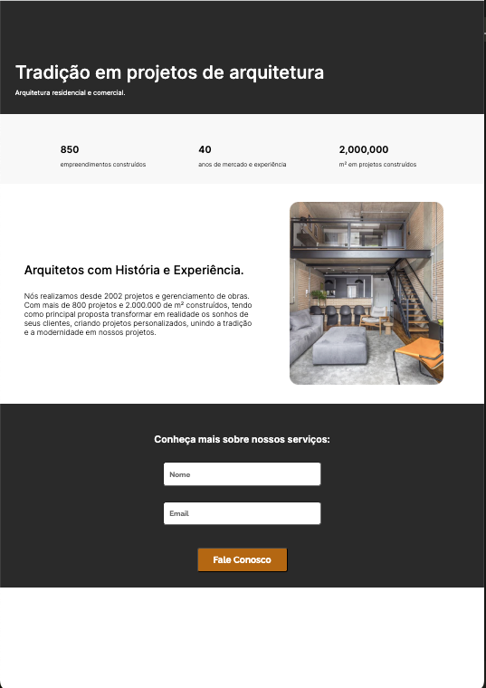

# Architecture Office

## Description

A project developed for the **Escola DNC** technology course.

This landing page is designed to showcase the works and services of an architecture firm.
It utilizes HTML5 for structure, CSS3 for styling, JavaScript for interactivity, and
SheetMonkey for data management.

**Screenshot**

## Project Setup:

1.  Clone this repository.
2.  Install requeired dependencies. (Bash)
3.  (Optional) Create a free account and configure the API key.

## Folder Structure:

- `src/`: Contains all project source files.
  - `image.svg`: Image for the landing page.
  - `index.html`: The main HTML file for the landing page.
  - `index.js`: JavaScript file for the interactivity.
  - `style.css`: Stylesheet for the landing page.

## Technologies used:

- HTML5: Provides the structure and the content for the landing page.
- CSS3: Styles the visual elements of the landing page.
- JavaScript: Adds interactive features to the landing page, creating more connectivity for the user.
- Google Fonts: Style the fonts to keep the project clean and beautiful.
- SheetMonkey (Optional): Used to manage data for the landing page content, is user-friendly, and brings connectivity to the project.

## Customization:

- Edit the content within index.html to reflect the architecture firm's vision and new information.
- Customize the style in style.css to match the firm's branding.
- If using SheetMonkey, update the API key and spreadsheet as needed.

## Getting Start

- [Click here](https://lp-arch-office.netlify.app/) to visit the deployed app!
- [Click here](https://docs.google.com/spreadsheets/d/1iEC0RgF6qKxwnIozkKmlHzTGrEgYhz3jboBacrlAu6k/edit?gid=0#gid=0) and see how it works!
